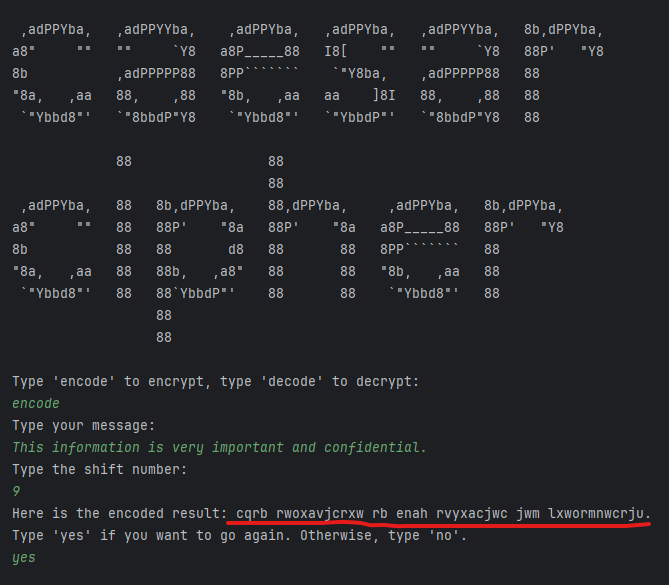
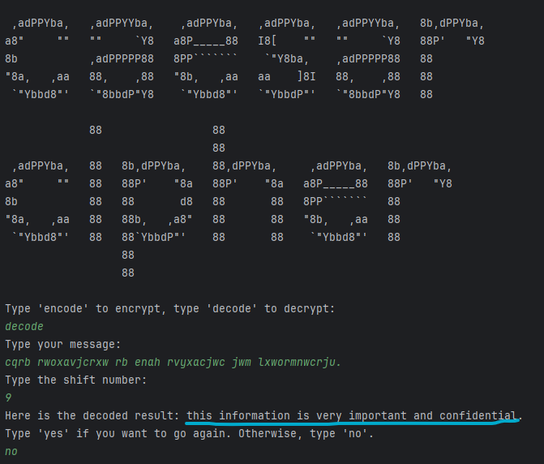

# Cifra de César 🔗

* A cifra de César é uma das mais simples e antigas técnicas de criptografia. Ela funciona deslocando cada letra do alfabeto por um número fixo de posições. Apesar de sua simplicidade, foi usada historicamente e demonstra o conceito básico de criptografia de substituição. Sua principal fraqueza é a facilidade de quebra, especialmente com análise de frequência.

-- Por exemplo, com um deslocamento de 3, 'A' se torna 'D', 'B' se torna 'E', e assim por diante. A mensagem cifrada é decifrada deslocando as letras na direção oposta.

## Codificando 🔒
* A utilização do código presente neste repositório tem o objetivo de codificar e decodificar textos, utilizando a cifra de césar.

--------------------------------------------------------------------
## Decodificando 🔓
* A mensagem acima que foi codificada, podemos decodificar apenas informando a função dentro do código:

